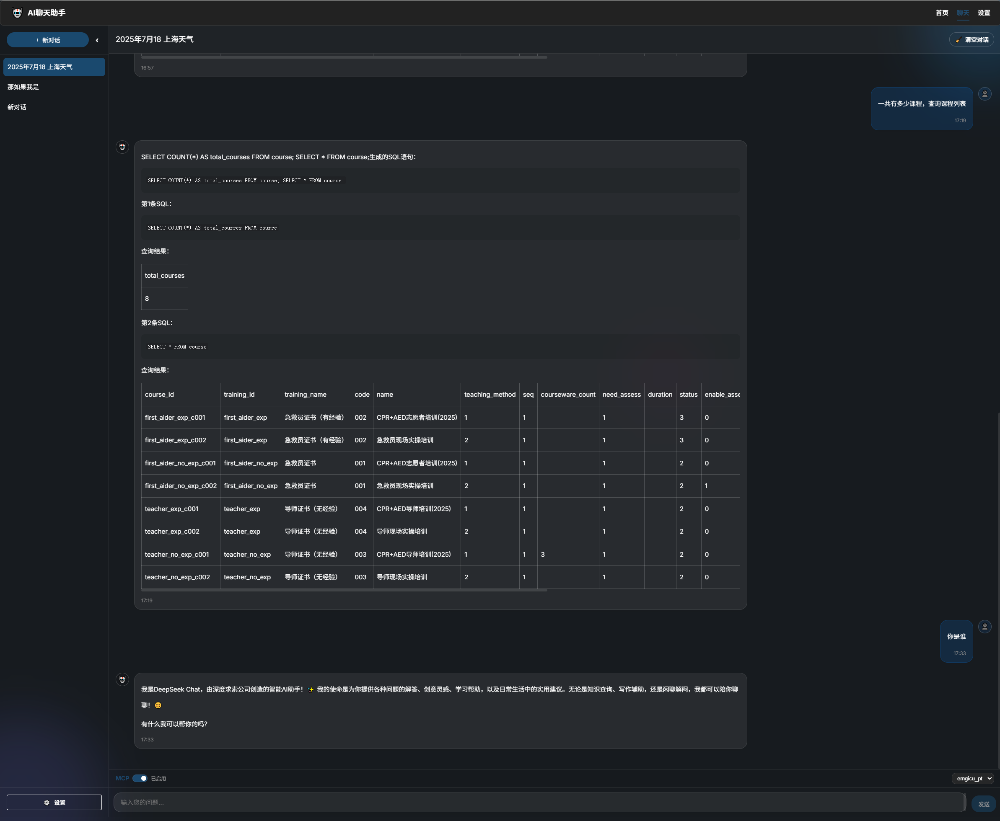

# 基于AI的自然语言数据库查询系统实践分享

## 一、项目背景

在日常的数据分析和业务支持中，很多人都希望能用“自然语言”直接查询数据库，而不必学习SQL语法。随着大模型（如OpenAI、DeepSeek等）的普及，AI驱动的自然语言数据库查询成为可能。本项目正是基于这一需求，打造了一个**前后端分离、支持AI自然语言查询数据库**的系统。

## 二、系统架构

项目采用**前后端分离**架构：

- **前端**：Vue3 + Element Plus + Vite，负责用户交互、表单输入、结果展示。
- **后端**：Node.js (20+) + Express + pm2 + MySQL，通过AI大模型将自然语言转为SQL，并安全执行。
- **AI服务**：支持OpenAI、DeepSeek等兼容OpenAI API的模型。
- **数据库**：MySQL，通过MCP中间件安全访问。



## 三、核心功能

1. **自然语言转SQL**  
   用户输入如“查询所有课程数量”，系统自动识别表结构，构造prompt，调用AI大模型生成SQL，并返回查询结果。

2. **数据库结构自动读取**  
   后端自动读取MySQL所有表及字段，辅助AI生成更准确的SQL。

3. **MCP配置管理**  
   支持多套数据库配置，激活后自动写入`.env`并用pm2重启服务，保证环境变量和数据库连接实时同步。

4. **AI聊天与历史记录**  
   支持与AI的自然语言对话，所有交互均可保存、回溯。

## 四、技术难点与亮点

### 1. AI Prompt设计

为了让AI生成的SQL更准确，后端会自动拼接表名、字段、主诉等信息，构造成结构化的prompt。例如：

```
请根据当前问题“查询所有课程数量”、表名列表“course, teacher, ...”、表结构信息“...”生成MySQL语句，要求只返回SQL语句且无注释。
```

### 2. SQL安全与多表支持

- 只允许只读查询（SELECT），防止AI生成危险的写操作。
- 支持多条SQL（如先统计再查询明细），并自动分割、顺序执行。

### 3. 动态环境变量与热重启

- MCP配置激活时，自动写入`.env`并用pm2重启后端，保证数据库连接实时生效。
- 支持多套数据库环境一键切换。

### 4. 前端体验优化

- 表单输入、结果表格、SQL展示、AI回复等全部可视化。
- 支持截图、历史记录、分栏展示等。

## 五、部署与运维

- **Node.js 20+**，后端用pm2守护进程，支持热重启、日志查看。
- 一键部署脚本（Windows/Linux），自动安装依赖并分别启动前后端。
- 配置简单，AI服务、数据库连接均可通过配置文件或界面管理。

## 六、常见问题与解决

- **AI接口无响应**：检查API Key和网络连通性。
- **SQL执行失败**：AI生成的SQL有误时，系统会返回详细错误信息，便于调试。
- **环境变量未生效**：激活MCP配置后需确保pm2重启成功。

## 七、未来展望

- 支持更多数据库类型（如PostgreSQL、MongoDB）。
- 增加权限管理、数据脱敏等安全功能。
- 支持更复杂的自然语言理解和多轮对话。

## 八、结语

AI+数据库的结合极大降低了数据查询门槛，让“用中文查数据”成为现实。希望本项目能为有类似需求的团队和开发者提供参考和帮助！

---

**项目地址**：  
（请补充你的GitHub/Gitee链接）

如有问题或建议，欢迎留言交流！ 